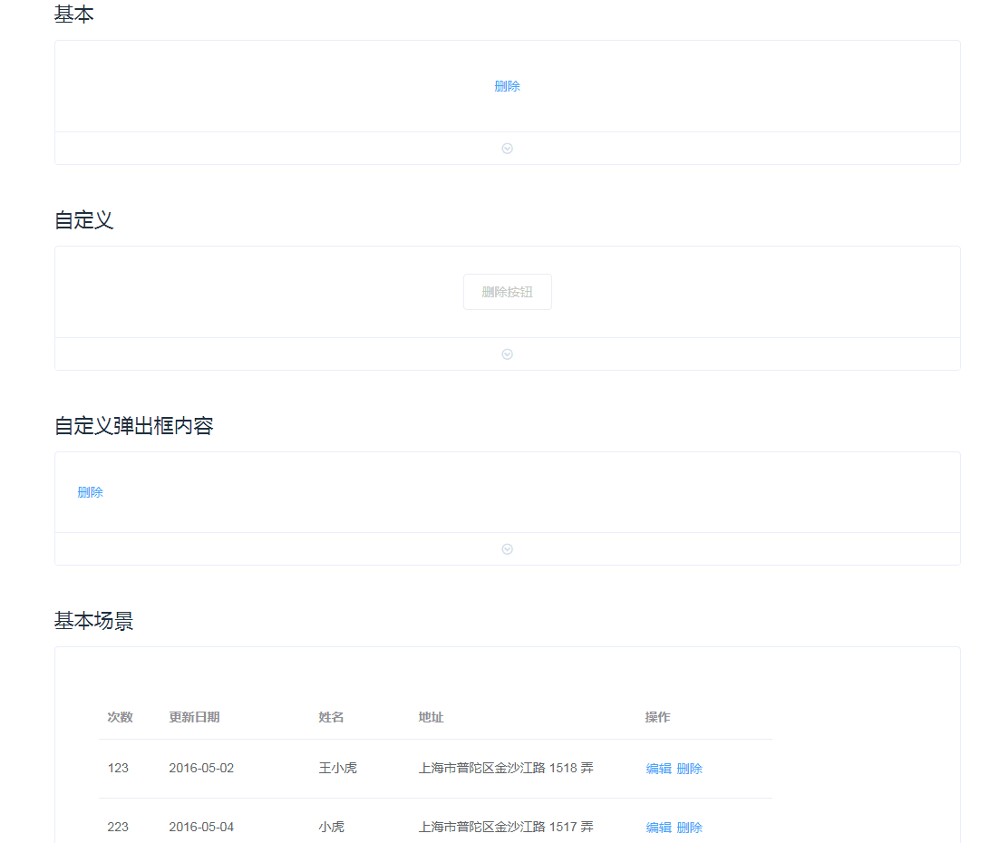

# action-confirm

> [Element](https://github.com/ElemeFE/element) a confirmation component that's based on element-ui.

## Install

```bash
npm install vue-action-confirm -S
```

## Quick Start

```bash
import Vue from 'vue'
import ActionConfirm from 'vue-action-confirm'
# Vue.component('vue-action-confirm', ActionConfirm) # 可以指定组件名称
Vue.use(ActionConfirm) # 组件名称 `vue-action-confirm`
```

For more information, please refer to [Progress](https://vue-multiple.github.io/action-confirm) in our documentation.

## Build Setup

``` bash
# install dependencies
npm install

# serve with hot reload at localhost:8080
npm run demo:dev

# build for demo with minification
npm run demo:build

# build for gh-pages with minification
npm run demo:prepublish

# build for production with minification
npm run build

# generate gh-pages
npm run deploy
```

## LICENSE

[MIT](http://opensource.org/licenses/MIT)

## 截图



## 基本用法
```
<template>
  <el-table
    :data="tableData"
    style="width: 701px">
    <el-table-column prop='id' label='次数' data-align='right' fixed width='68'></el-table-column>
    <el-table-column
      prop="date"
      label="更新日期"
      width="165">
    </el-table-column>
    <el-table-column
      prop="name"
      label="姓名"
      width="110"
    >
    </el-table-column>
    <el-table-column
      prop="address"
      width='250'
      label="地址">
    </el-table-column>
    <el-table-column
      label="操作"
      fixed="right"
      width="108">
      <template slot-scope="scope">
        <vue-action-confirm
          title="确定删除吗？"
          @confirm="onConfirm(scope.row)"
        >
          <el-button type="text" class="delete-btn" slot="reference">删除</el-button>
        </vue-action-confirm>
      </template>
    </el-table-column>
  </el-table>
</template>
```
```
<script>
import VueActionConfirm from 'vue-action-confirm';

export default {
  componenets: {
    VueActionConfirm
  },

  data() {
    return {
      tableData: [{
        id: 123,
        date: '2016-05-02',
        name: '王小虎',
        address: '上海市普陀区金沙江路 1518 弄',
        tags: ["标签1", "标签很长很长很长很长很长很长", "标签很长很长很长很长很长很长", "标签"],
      }, {
        id: 223,
        date: '2016-05-04',
        name: '小虎',
        address: '上海市普陀区金沙江路 1517 弄',
        tags: ["标签1", "标签很长很长很长很长很长很长", "标签很长很长很长很长很长很长", "标签"],
      }, {
        id: 32,
        date: '2016-05-01',
        name: '王小虎',
        address: '上海市普陀区金沙江路 1519 弄',
        tags: ["标签1", "标签很长很长很长很长很长很长", "标签很长很长很长很长很长很长", "标签"],
      }, {
        id: 4,
        date: '2016-05-03',
        name: '王小虎',
        address: '上海市普陀区金沙江路 1516 弄',
        tags: ["标签1", "标签很长很长很长很长很长很长", "标签很长很长很长很长很长很长", "标签"],
      }]
    }
  },

  methods: {
    onConfirm(item) {
      console.log('confirm', item);
    }
  }
}
</script>
```

## ActionConfirm props

| 参数   | 说明  | 类型  | 可选值  | 默认值  |
|----------|---------|---------|-----------|-----------|
| title | 标题 | String  | - | - |
| popper-ref | Popover引用名称 | String  | popover |
| popper-props | Popover参数 | Object  | 参考[popover组件](https://element.eleme.io/#/zh-CN/component/popover) | { placement: 'top' } |
| disabled | Popover 是否可用 | Boolean  | - | false |
| show-confirm | 是否显示确认按钮 | Boolean  | - | true |
| show-cancel | 是否显示取消按钮 | Boolean  | - | true |
| btn-ok-class | 为确认按钮添加类名 | String  | - | action-confirm-ok |
| btn-cancel-class | 为取消按钮添加类名 | String  | - | action-cancel-ok |
| btn-ok-label | 确认按钮文案 | String  | - | 确认 |
| btn-cancel-label | 取消按钮文案 | String  | - | 取消 |
| btn-ok-disabled | 是否置灰确认按钮 | String  | - | false |
| btn-cancel-disabled | 是否置灰取消按钮 | String  | - | false |
| btn-reference-class | 为默认触发按钮添加类名 | String  | - | reference-btn |
| btn-reference-label | 默认触发按钮文案 | String  | - | 删除 |
| loading | 加载状态 | Boolean  | - | false |

## ActionConfirm events
| 事件名称   | 说明  | 回调参数  |
|----------|---------|---------|
| show | 显示时触发 | - |
| hide | 隐藏时触发 | - |
| visible-change | 出现/隐藏时触发 | 出现则为true,隐藏则为false |
| confirm | 确认时触发 | - |
| cancel | 取消时触发 | - |

## ActionConfirm slot
| 名称   | 说明  |
|----------|---------|
| - | 弹出框的内容 |
| footer | 弹出框的尾部内容，默认显示确认和取消按钮 |
| reference | 触发弹出框显示的 HTML 元素 |